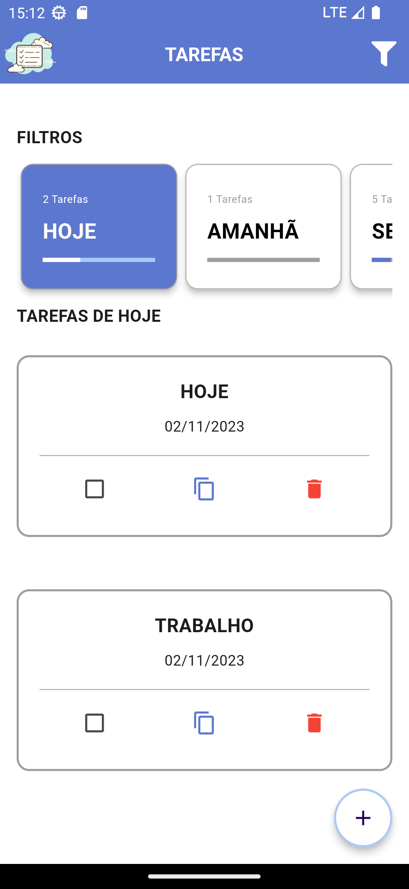
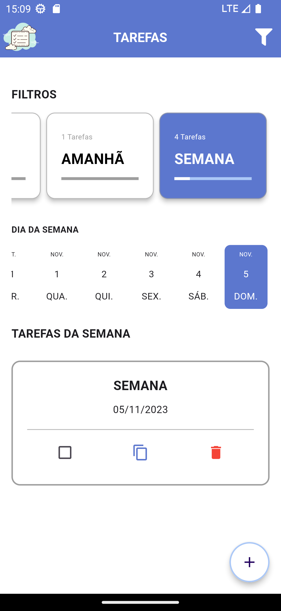
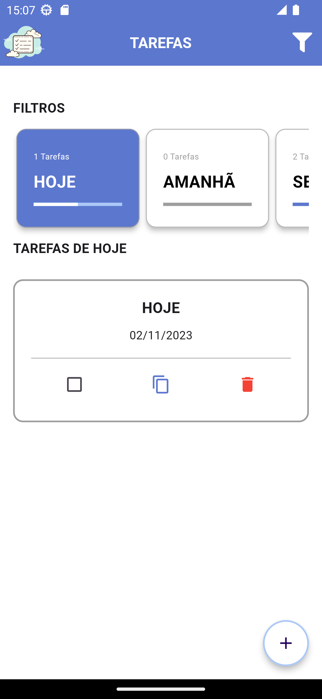
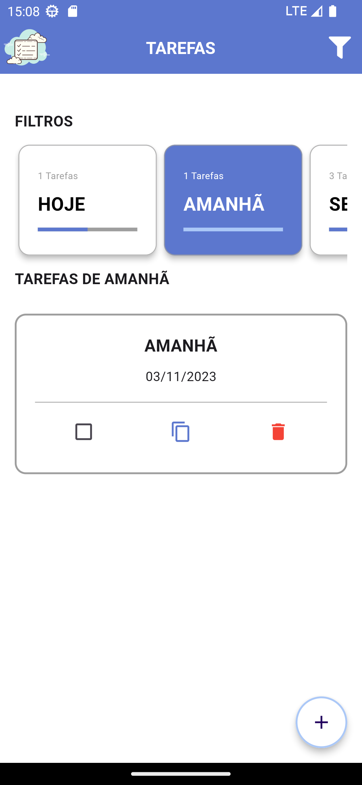
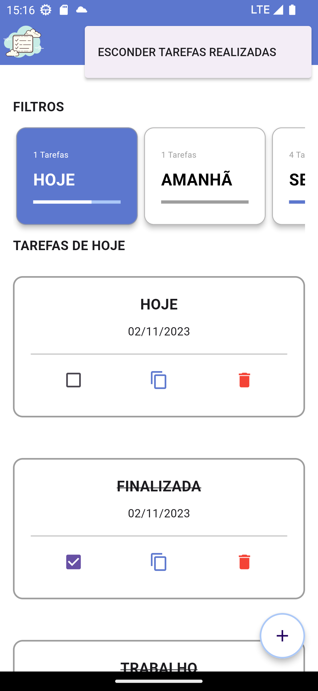
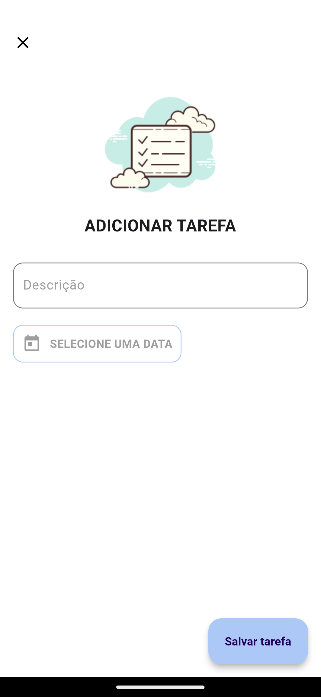
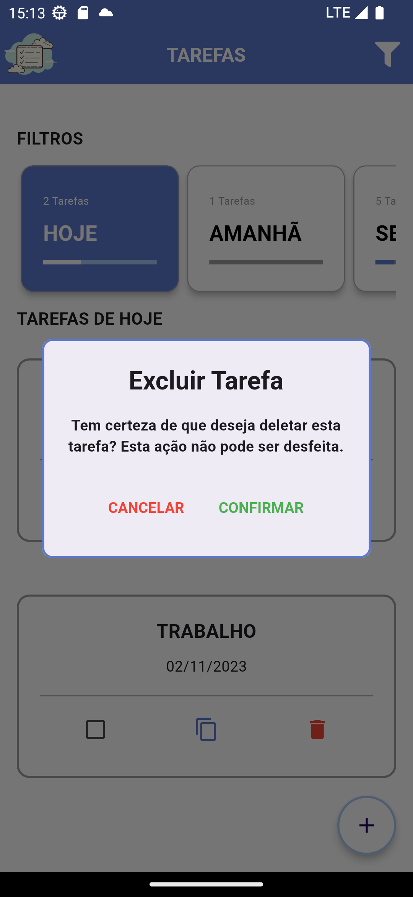
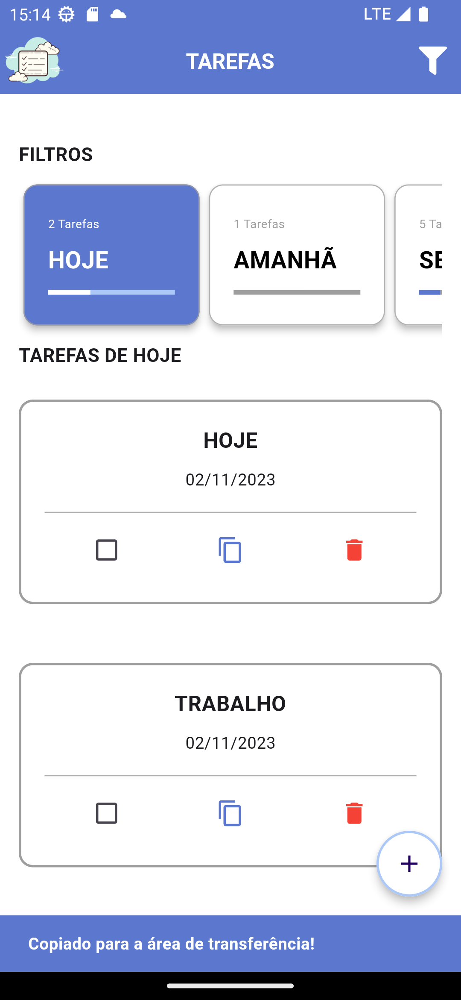

# Todo_List

Este é um aplicativo de lista de tarefas desenvolvido com Flutter, GetX e SQLite, que proporciona uma maneira simples e eficaz de gerenciar suas tarefas diárias. 

## Funcionalidades

- **Filtragem por Semana:** Veja todas as tarefas planejadas para a semana atual.
- **Filtragem por Hoje:** Visualize as tarefas que você planejou para o dia atual.
- **Filtragem por Amanhã:** Planeje suas tarefas para o próximo dia.
- **Exibição/Ocultação de Tarefas Concluídas:** Escolha se deseja ver ou ocultar as tarefas que você já concluiu.
- **Adicionar Tarefa:** Adicione novas tarefas à sua lista.
- **Excluir Tarefa:** Remova tarefas que não são mais necessárias.
- **Copiar Textos das Tarefas:** Copie o texto das suas tarefas para a área de transferência para uso posterior.

## Versão

- Flutter 3.13.4-0.0.pre.3 • channel stable •
- Dart SDK version: 3.1.1 (stable)

## Capturas de Tela

Aqui estão algumas capturas de tela do aplicativo para lhe dar uma ideia de como ele se parece:

1. Tela principal com lista de tarefas:

2. Filtragem por Semana:

3. Filtragem por Hoje:

4. Filtragem por Amanhã:

5. Tarefas Concluídas Visíveis:

6. Adicionar Tarefa:

7. Excluir Tarefa:

8. Copiar Texto da Tarefa:

